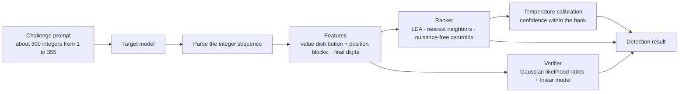

[Ranking, verification, and calibration](./ranking.mdx) explains how the features score the candidates. The [tokenizer probe](./tokenizer.mdx) looks only at the token counts in usage; its result is reference information shown on its own and does not enter the ranking or the confidence of the number fingerprint.

## Challenges

Each round generates 3 challenges. The requested count of each challenge comes from 292–332 without repetition. Each challenge independently uses Chinese, English, Japanese, Korean, or French, and random equivalent templates in that language supply the wording. The prompt tells the model to choose the integer at each position separately, from 1 to 355, by first instinct. The prompt forbids tools and code. It also forbids counting from 1, monotonically increasing or decreasing runs, arithmetic progressions, cycles, and other rule-made patterns. As a result, the sequence mainly shows the value preferences of the model itself.

The reference bank uses a different fixed set of 36 challenges: 3 challenges in each of 12 prompt environments, with requested counts from 218 to 333. The environments differ in whether a system prompt or a user prefix is added.

## Parsing

The parser takes the longest run of integers from 1 to 355 in the answer. A letter ends a run. Let $N$ be the requested count. An answer with fewer than $\max(80, \lceil 0.55N \rceil)$ valid integers is not scored. This rule removes refusals and badly truncated answers.

## Features

Each answer becomes two feature blocks.

**Value distribution**: the counts of the 355 values are smoothed and square-rooted (Hellinger embedding). Thus, the Euclidean distance between features is proportional to the Hellinger distance:

$$
\phi_i = \sqrt{\frac{c_i + \alpha}{\sum_{j=1}^{355} c_j + 355\alpha}}, \qquad \alpha = 0.5
$$

**Positions and final digits**: the sequence is split into 4 equal blocks, each with 16 value bins. The distribution of final digits 0–9 is added, for $4 \times 16 + 10 = 74$ dimensions. These values are also smoothed and square-rooted.

Each block is standardized and normalized to unit length. The two blocks are then concatenated with weights of 0.75 : 0.25.
