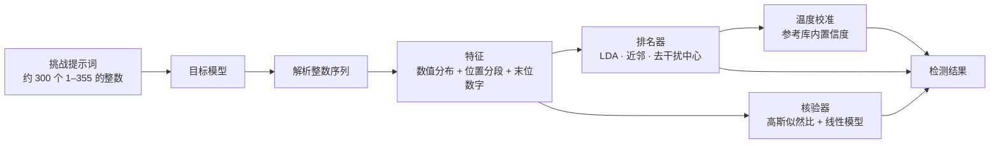

本页介绍挑战、解析和特征；[排名、核验与校准](./ranking.mdx)介绍如何用特征给候选打分；[词表探测](./tokenizer.mdx)是另一条独立的检测路径，只看 usage 中的 token 计数。

## 挑战

每轮生成 3 道挑战。每道挑战要求的数量从 292–332 中不重复抽取，措辞由多组模板随机组合。提示词要求模型逐个位置凭第一反应选择 1–355 的整数，禁止调用工具或代码，也禁止从 1 开始计数、单调递增或递减、等差、循环等规则化模式。因此，得到的序列主要反映模型自身的取值偏好。

参考库使用另一套固定的 36 道挑战：12 种提示环境各 3 道，要求数量为 218–333。提示环境的区别在于是否附加系统提示词或用户前缀。

## 解析

解析器从回答中取出最长的一段 1–355 整数；字母会打断一段序列。设 $N$ 为要求数量，有效整数少于 $\max(80, \lceil 0.55N \rceil)$ 的回答不参与评分。拒答和严重截断的回答因此被排除。

## 特征

每条回答转换为两块特征。

**数值分布**：355 个取值的计数经平滑后开平方（Hellinger 嵌入）。这样，特征之间的欧氏距离与 Hellinger 距离成正比：

$$
\phi_i = \sqrt{\frac{c_i + \alpha}{\sum_{j=1}^{355} c_j + 355\alpha}}, \qquad \alpha = 0.5
$$

**位置与末位**：序列均分为 4 段，每段统计 16 个取值区间；再加上末位数字 0–9 的分布，共 $4 \times 16 + 10 = 74$ 维，同样平滑后开平方。

两块特征分别标准化并单位化，再按 0.75 : 0.25 的权重拼接。
