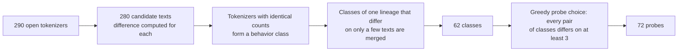

The integer fingerprint compares the output preferences of a model. The tokenizer probe compares how the upstream counts tokens. It needs only the input token count that the API reports in the usage of each response, and it does not depend on how the model answers. So even if the upstream rewrites the reply, the result is not affected as long as the count comes from the real tokenizer.

## Differential counts

Each request holds one user message: a fixed prefix $P$, the probe text $t_j$, and a fixed suffix $S$. The prefix is `Reply with OK.\n<<<\n` and the suffix is `\n>>>`. The prefix starts and the suffix ends with a non-whitespace character, so a chat template that trims leading and trailing whitespace does not change the count. The baseline request sends only $P + S$. Then

$$
x_j - x_0 = \operatorname{count}(P\,t_j\,S) - \operatorname{count}(P\,S)
$$

The fixed overhead of the chat template, injected system prompts, and special tokens cancels out in the difference. Each protocol reads a different field: Chat Completions uses `prompt_tokens`, Responses uses `input_tokens`, and Messages uses `input_tokens + cache_creation_input_tokens + cache_read_input_tokens`. Streaming responses are read from the events that carry usage. Chat Completions requests add `stream_options.include_usage`, Messages reads `message_start` and `message_delta`, and Responses reads `response.completed`.

## Tokenizer bank

The tokenizer bank `data/tokenizer_bank.json` is generated offline by the tokenizer archive tool llm-tokenizer-fingerprint. It computes the same difference for every open tokenizer:

After a lineage is merged, the differing counts of class members on individual probes are kept as `alternatives`, and any of these values counts as a match. The 72 probes cover CJK scripts, Indic scripts, Southeast Asian scripts, Cyrillic, Arabic, Hebrew, Greek, Armenian, and Georgian, as well as Latin text, code, whitespace, symbols, emoji, and structured text.

## Posterior [#posterior]

The posterior covers three kinds of hypotheses:

| Hypothesis | Prior | Meaning |
| --- | --- | --- |
| A listed class | 0.8 | The upstream uses a tokenizer of this class. Deviations come only from rare measurement errors |
| An unlisted tokenizer close to a class | 0.1 | A sizable share of probes differ from the class |
| A tokenizer unrelated to every class | 0.1 | The difference on each probe follows the smoothed distribution over all classes |

The residual $r$ of each probe (the difference between the measured value and the closest allowed value of the class) follows a two-component discrete Laplace mixture with a floor:

$$
\ell(r) = \log\bigl((1-\rho)\,g_{0.02}(r) + \rho\,g_{0.85}(r) + 10^{-6}\bigr), \qquad g_p(r) = \frac{1-p}{1+p}\,p^{\lvert r\rvert}
$$

The narrow component models exact matches, and the wide component absorbs occasional deviations. The floor means that one outlier costs a bounded amount of evidence. The contamination rate $\rho$ is not fixed. It is marginalized over a grid of values: 0.02, 0.06, and 0.15 for listed classes, and 0.2, 0.4, and 0.7 for close tokenizers. The hidden overhead is marginalized over a window of ±3 tokens around the baseline. The baseline itself observes the overhead directly and uses a fixed contamination rate.

## Probe selection [#selection]

The next batch of probes maximizes the pairwise Bhattacharyya bound:

$$
F(S) = \sum_{a<b} \sqrt{w_a w_b}\,\Bigl(1 - \prod_{j \in S} \mathrm{BC}_j(a, b)\Bigr)
$$

Here $w$ is the current posterior, and $\mathrm{BC}_j(a,b)$ is the Bhattacharyya coefficient of the predicted distributions of the two classes on probe $j$. It bounds the MAP error rate from above and is monotone submodular, so the greedy batch is within $1 - 1/e$ of the best batch. With exact counts, it reduces to equivalence-class edge cutting (EC²). Planning covers only the 24 classes with the highest posterior, and the plan for the first batch is cached.

Probing stops when one of these holds:

- One class or "unlisted" reaches 99% posterior probability after at least 4 probes have been answered.
- The best batch improves the bound by less than $10^{-4}$.
- The probe limit is reached (20 probes by default).

A final baseline is then measured again. If the two baselines differ, the upstream adds hidden content that changes, and the result carries a notice.

## Verdicts and model check

| Verdict | Condition | Reported probability |
| --- | --- | --- |
| `exact` Exact match | The posterior of one class is at least the total of "unlisted" | The probability that it is exactly this class |
| `related` Unlisted · closest | The close-tokenizer posterior of one class is at least that of "unrelated tokenizer" | The probability that it is a tokenizer close to this class |
| `unknown` Unlisted tokenizer | All other cases | The probability of any unlisted tokenizer |

The model name you entered is stripped of its provider prefix and `:` suffix. It is then matched against the [first-party model mapping](#api-models), and then against the aliases registered for each class. The probability of the check is the posterior that the upstream uses a registered class (exactly that class or a relative of it); for a model mapped to `null` (the vendor has not published its tokenizer), it is the posterior of "unlisted" instead. A probability of 0.9 or more is consistent, 0.1 or less is inconsistent, and anything between is not yet clear. A model that matches neither the mapping nor the aliases shows only the tokenizer verdict.

## Evaluation [#evaluation]

The upstream is simulated offline on the 62 tokenizer classes, with a random hidden overhead. `eps05` means each probe deviates by 1–2 tokens with 5% probability, and `eps15` means each probe deviates by 1–4 tokens with 15% probability:

| Setting | Top-1 correct | Mean requests |
| --- | --- | --- |
| One at a time, no noise | 62 / 62 | About 11 |
| One at a time, `eps05` | 62 / 62 | — |
| One at a time, `eps15` | 61 / 62 | — |
| 4 at a time, no noise | 62 / 62 | About 13 |

For confidences in the 0.9–1 range, the mean confidence is 0.987 and the actual accuracy is 1.000, so the confidence is slightly conservative.

In a leave-one-class-out evaluation, each class in turn is removed from the tokenizer bank and then probed with its own counts. In 8 / 62 runs, the class is identified as another listed class. All of these are tokenizer pairs in which one derives from or extends the other, such as cl100k_base and StableLM 2, GPT-2 and CodeGen, Llama 3 and Qianfan VL, and Llama 2 and OpenHathi. An extended tokenizer counts almost the same as the original on the probes, so the counts alone cannot tell them apart.

## Limitations

- A tokenizer match shows only that the tokenizer is the same. One tokenizer often serves several models. For example, Xiaomi MiMo and MiniCPM-V reuse the Qwen2–Qwen3 tokenizer.
- A relay that estimates usage locally with tiktoken also measures as o200k_base or cl100k_base.
- An unlisted tokenizer that extends a listed one may be identified as the original tokenizer. See the leave-one-class-out evaluation above.
- Probing is not possible when the upstream does not report usage or reports modified counts.

## Listed tokenizer classes [#classes]

The table below is generated directly from the current `data/tokenizer_bank.json` and grouped by authoring lab.

<TokenizerClasses />

## First-party model mapping [#api-models]

<TokenizerClasses view="models" />

## References

- D. Golovin, A. Krause, D. Ray. [Near-Optimal Bayesian Active Learning with Noisy Observations](https://arxiv.org/abs/1010.3091). NIPS 2010. Equivalence-class edge cutting (EC²).
- D. Golovin, A. Krause. [Adaptive Submodularity: Theory and Applications in Active Learning and Stochastic Optimization](https://arxiv.org/abs/1003.3967). JAIR 2011.
- Y. Chen, A. Krause. [Near-optimal Batch Mode Active Learning and Adaptive Submodular Optimization](https://proceedings.mlr.press/v28/chen13b.html). ICML 2013. Greedy batch strategy.
- A. Krause, C. Guestrin. [Near-optimal Nonmyopic Value of Information in Graphical Models](https://arxiv.org/abs/1207.1394). UAI 2005. Submodularity of information gain and the $1-1/e$ approximation.
- T. Kailath. [The Divergence and Bhattacharyya Distance Measures in Signal Selection](https://www.semanticscholar.org/paper/The-Divergence-and-Bhattacharyya-Distance-Measures-Kailath/b5b2ee1af1c0a867f564e44f3f79b8d2bdeca749). IEEE Trans. Commun. Technol., 1967. Bhattacharyya distance and error probability.
- A. Ghosh, T. Roughgarden, M. Sundararajan. [Universally Utility-Maximizing Privacy Mechanisms](https://arxiv.org/abs/0811.2841). STOC 2009. Two-sided geometric (discrete Laplace) distribution.
- N. Brümmer. [Generative, Fully Bayesian, Gaussian, Openset Pattern Classifier](https://arxiv.org/abs/1307.6143). 2013. Open-set Bayesian decision.
- D. Pasquini, E. Kornaropoulos, G. Ateniese. [LLMmap: Fingerprinting for Large Language Models](https://arxiv.org/abs/2407.15847). USENIX Security 2025. Related work on model fingerprinting.
