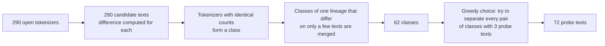

The goal is to find out which tokenizer the API uses (the rule a model uses to cut text into tokens) with as few short requests as possible, show that finding as reference information next to the ranking of the number fingerprint, and check it against the model you entered. The number fingerprint compares the output preferences of a model; the tokenizer probe compares how the upstream counts tokens. It needs only the input token count that the API reports in the `usage` of each response, and it does not depend on how the model answers. As long as the counts come from the upstream's real tokenizer, a rewritten reply does not affect the result.

## Differential counts

Each request holds one user message: a fixed prefix $P$, a short probe text $t_j$, and a fixed suffix $S$; the prefix and suffix together are the wrapper. The prefix is `Reply with OK.\n<<<\n` and the suffix is `\n>>>`. The prefix starts and the suffix ends with a non-whitespace character, so a chat template that trims leading and trailing whitespace does not change the count. The baseline request sends the wrapper alone, $P + S$. Then

$$
x_j - x_0 = \operatorname{count}(P\,t_j\,S) - \operatorname{count}(P\,S)
$$

Hidden input such as the chat template, injected system prompts, and special tokens cancels out in the difference. Each protocol reads a different field: Chat Completions uses `prompt_tokens`, Responses uses `input_tokens`, and Messages uses `input_tokens + cache_creation_input_tokens + cache_read_input_tokens`. Streaming responses are read from the events that carry usage. Chat Completions requests add `stream_options.include_usage`, Messages reads `message_start` and `message_delta`, and Responses reads `response.completed`. A field that a later event reports as `null` does not replace a count already read. Reading stops at the protocol's terminal event (`[DONE]`, `message_stop`, `response.completed`, or `response.incomplete`) once usage is known, without waiting for the upstream to close the connection.

## Tokenizer bank

The tokenizer bank `data/tokenizer_bank.json` is generated offline by the tokenizer archive tool llm-tokenizer-fingerprint. It computes the same difference for every open tokenizer:

After a lineage is merged, the differing counts of class members on individual probe texts are kept as `alternatives`, and any of these values counts as a match. The 72 probe texts cover CJK scripts, Indic scripts, Southeast Asian scripts, Cyrillic, Arabic, Hebrew, Greek, Armenian, and Georgian, as well as Latin text, code, whitespace, symbols, emoji, and structured text.

## Posterior [#posterior]

The posterior probability is how plausible each hypothesis is after all counts are in. There are three kinds of hypotheses:

| Hypothesis | Prior | Meaning |
| --- | --- | --- |
| A listed class | 0.8 | The upstream uses that tokenizer class; deviations come only from rare measurement errors |
| An unlisted tokenizer close to a class | 0.1 | A sizable share of probe texts count differently from that class |
| A tokenizer unrelated to every class | 0.1 | The difference of each probe text follows a smoothed distribution over all classes |

The narrow component models exact agreement, the wide component absorbs occasional deviations, and the floor limits how much evidence one outlier can remove. The residual $r$ of a probe text (the observed difference minus the nearest allowed value of the class) follows a two-component discrete Laplace mixture with a floor:

$$
\ell(r) = \log\bigl((1-\rho)\,g_{0.02}(r) + \rho\,g_{0.85}(r) + 10^{-6}\bigr), \qquad g_p(r) = \frac{1-p}{1+p}\,p^{\lvert r\rvert}
$$

The contamination rate $\rho$ is marginalized over a grid of values: 0.02, 0.06, and 0.15 for listed classes, and 0.2, 0.4, and 0.7 for close unlisted tokenizers. The length of the hidden input is marginalized over a window of ±3 tokens around the baseline; the baseline request observes the hidden input directly and uses a fixed contamination rate.

## Choosing probe texts [#selection]

Each batch picks the probe texts that best separate the candidates still in doubt. Each candidate class contributes two atoms: "exactly this class", weighted by the posterior probability of the class, and "an unlisted relative of this class", weighted by the posterior probability of that relative. A tokenizer unrelated to every class is one more atom. Each class forms its own group, and the relatives and the unrelated tokenizer together form the "unlisted" group. The criterion is the pairwise Bhattacharyya bound, summed only over pairs of atoms in different groups:

$$
F(S) = \sum_{\substack{a<b \\ g(a) \ne g(b)}} \sqrt{\tilde w_a \tilde w_b}\,\Bigl(1 - \prod_{j \in S} \mathrm{BC}_j(a, b)\Bigr), \qquad \tilde w_a = \frac{w_a}{\sum_c w_c}
$$

Here $g(a)$ is the group of atom $a$, $w$ is the posterior probability of an atom, $\tilde w$ is its weight normalized over the atoms in the plan, and $\mathrm{BC}_j(a,b)$ is the Bhattacharyya coefficient of the predicted distributions of two atoms on probe text $j$, that is, how much the two predictions overlap; the more they overlap, the less that probe text can tell them apart. Before the first answer, every class takes part with equal weight, through its "exactly this class" atom only. After that, only the 24 classes with the highest posterior probability (exact plus relative) and the unrelated tokenizer take part. The bound is an upper bound on the MAP error (the chance of being wrong when the most probable group is taken as the answer) and is monotone submodular, which means each extra probe text adds less than the one before, so greedy selection comes with a guarantee: the greedy batch is within $1 - 1/e$ of the best batch. With exact counts it reduces to equivalence-class edge cutting (EC², cutting apart the classes that are still confused, pair by pair).

Stopping conditions:

- one class or "unlisted" reaches 99% posterior probability after at least 4 probe texts are answered;
- or the best batch improves the bound by less than $10^{-4}$;
- or the probe text limit (20 by default) is reached.

A final baseline request follows. Two different baseline counts mean that the upstream adds hidden input of varying length, and the result carries a warning.

## Verdict and claim check

| Verdict | Condition | Reported probability |
| --- | --- | --- |
| `exact` Exact match | The posterior probability of one class is at least the total of "unlisted" | The probability of exactly that class |
| `related` Close to a listed class | The posterior probability of the close unlisted tokenizer of one class is at least that of an unrelated tokenizer | The probability of the close tokenizer of that class |
| `unknown` Not listed | All other cases | The probability of any unlisted tokenizer |

The model name you entered is stripped of any provider prefix and `:` suffix. It is matched first against the [vendor model mapping](#api-models), then against the aliases of each class. A vendor mapping names the one tokenizer the vendor has published, so the claim probability is the posterior probability that the upstream uses exactly that class; an unlisted relative does not match. An alias names an open-weight lineage, which can have retrained variants, so the claim probability is the posterior probability that the upstream uses that class or a close tokenizer. For models mapped to `null` (the vendor has not published a tokenizer), the posterior probability of "unlisted" is used instead. A probability of at least 0.9 is consistent, at most 0.1 is inconsistent, and anything else is not yet clear. Models that match neither the mapping nor any alias cannot be checked.

## Relation to the ranking [#ranking]

The tokenizer result is reference information only. The verdict, the candidate tokenizers, the request log, and the claim check above are shown on their own next to the ranking. They do not change the candidate ranking or the confidence, and the detection result does not wait for the probe. One tokenizer is often reused by several models, and a relay may estimate usage locally, so the counts answer one question only: whether the upstream's tokenizer matches the model you entered.

## Evaluation [#evaluation]

Simulated upstreams over the 62 tokenizer classes (random length of hidden input; `eps05` means that each probe text is off by 1–2 tokens with 5% probability, and `eps15` means it is off by 1–4 tokens with 15% probability):

| Setting | Correct top candidate | Mean requests |
| --- | --- | --- |
| One at a time, no noise | 62 / 62 | about 11 |
| One at a time, `eps05` | 62 / 62 | not measured |
| One at a time, `eps15` | 61 / 62 | not measured |
| 4 at a time, no noise | 62 / 62 | about 13 |

The mean confidence in the 0.9–1 bin is 0.987, and the actual accuracy there is 1.000.

A leave-one-class-out evaluation removes each class from the tokenizer bank in turn and probes with that class's counts. In 8 / 62 runs, the class is identified as another listed class. All of these are pairs in which one tokenizer derives from or extends the other, such as cl100k_base and StableLM 2, GPT-2 and CodeGen, Llama 3 and Qianfan VL, and Llama 2 and OpenHathi. An extended tokenizer counts almost the same as the original on the probe texts, so the counts alone cannot tell them apart.

## Limitations

- A tokenizer match only shows the same tokenizer. One tokenizer is often reused by several models. For example, Xiaomi MiMo and MiniCPM-V reuse the Qwen2 to Qwen3 tokenizer.
- A relay that estimates usage locally with tiktoken also measures as o200k_base or cl100k_base.
- An unlisted tokenizer that extends a listed one may be identified as the original tokenizer. See the leave-one-class-out evaluation above.
- The probe does not work when the upstream reports no usage, or when the reported count has been altered.

## Listed tokenizers [#classes]

<TokenizerClasses />

## Vendor model mapping [#api-models]

<TokenizerClasses view="models" />

## References

- D. Golovin, A. Krause, D. Ray. [Near-Optimal Bayesian Active Learning with Noisy Observations](https://arxiv.org/abs/1010.3091). NIPS 2010. Equivalence-class edge cutting (EC²).
- D. Golovin, A. Krause. [Adaptive Submodularity: Theory and Applications in Active Learning and Stochastic Optimization](https://arxiv.org/abs/1003.3967). JAIR 2011.
- Y. Chen, A. Krause. [Near-optimal Batch Mode Active Learning and Adaptive Submodular Optimization](https://proceedings.mlr.press/v28/chen13b.html). ICML 2013. The greedy batch strategy.
- A. Krause, C. Guestrin. [Near-optimal Nonmyopic Value of Information in Graphical Models](https://arxiv.org/abs/1207.1394). UAI 2005. Submodularity of information gain and the $1-1/e$ approximation.
- T. Kailath. [The Divergence and Bhattacharyya Distance Measures in Signal Selection](https://www.semanticscholar.org/paper/The-Divergence-and-Bhattacharyya-Distance-Measures-Kailath/b5b2ee1af1c0a867f564e44f3f79b8d2bdeca749). IEEE Trans. Commun. Technol., 1967. The Bhattacharyya distance and the probability of error.
- A. Ghosh, T. Roughgarden, M. Sundararajan. [Universally Utility-Maximizing Privacy Mechanisms](https://arxiv.org/abs/0811.2841). STOC 2009. The two-sided geometric (discrete Laplace) distribution.
- N. Brümmer. [Generative, Fully Bayesian, Gaussian, Openset Pattern Classifier](https://arxiv.org/abs/1307.6143). 2013. Open-set Bayesian decisions.
- D. Pasquini, E. Kornaropoulos, G. Ateniese. [LLMmap: Fingerprinting for Large Language Models](https://arxiv.org/abs/2407.15847). USENIX Security 2025. Related work on model fingerprinting.
