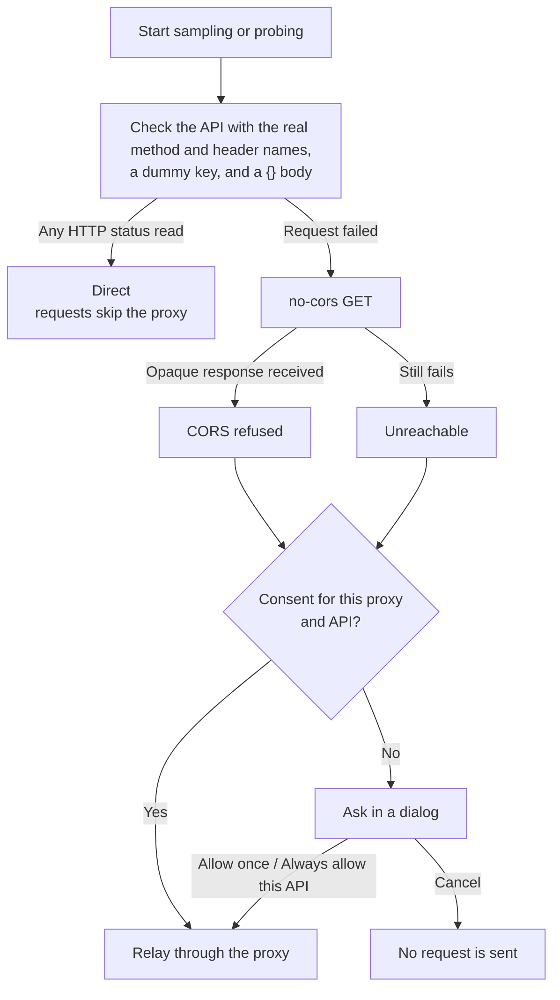

A browser can read responses only from APIs that allow cross-origin requests (CORS). Many relays and third-party APIs do not allow them, so a server has to relay the requests. The page leaves the choice of using a proxy to you. When a direct call is possible, the page calls the API directly, and the key passes through no third party. When it is not possible, the page first explains why in a dialog and relays the requests only after you agree.

## Connection check

Before each sampling or probe run starts, the page decides the route as follows:

The check request uses the method and header names of the real request (the Messages protocol adds `anthropic-dangerous-direct-browser-access: true`). Its key is the dummy `sk-cors-probe` and its body is `{}`, so the upstream rejects it before it runs the model. Neither direct requests nor check requests carry cookies or a Referer, and neither follows redirects, so a redirect cannot send the key elsewhere.

The result is cached for 10 minutes in the page session. After a direct request hits a network error, the next run checks again. A failed direct request is not switched to the proxy automatically.

## Consent dialog

When a proxy is needed, the dialog names the API host, the reason (CORS refused or unreachable), and the proxy that the requests will pass through. It also lists three points: the key, prompts, and replies pass through that proxy; how the proxy handles the key; and that consent can be revoked.

- **Cancel**: sends no requests. Pressing Esc, clicking the backdrop, or clicking the close button also counts as Cancel.
- **Allow once**: valid only in the current page session.
- **Always allow this API**: saved in the browser's localStorage and takes effect in other tabs at the same time.

Consent is recorded per pair of proxy and API origin, so switching to another proxy asks again. In the API configuration, the status line below the Base URL shows where the next request will go. A remembered consent has a "Revoke proxy consent" link next to it, and revoking takes effect immediately.

## Relay proxy

"Relay proxy" at the bottom of the API configuration decides where requests go when a proxy is needed. It is a browser-level setting. It applies to all configuration profiles and is not written to exported configuration files.

<Tabs items={['This site', 'Own Worker']}>
  <Tab value="This site">
    The same-origin `/api/proxy`, provided by a Cloudflare Pages Function. The proxy does not store keys or log request content. Static sites without server functions, such as GitHub Pages, do not have this proxy.
  </Tab>
  <Tab value="Own Worker">
    Enter the address of the Worker you deployed, for example `https://fingerpoint-api-proxy.<subdomain>.workers.dev`. Only HTTPS is accepted. For local testing, `http://localhost` or `http://127.0.0.1` also works. The address is saved as you type. If you clear it or change it to an invalid address, the saved address is cleared too. A run that needs the proxy then does not start and asks you to enter the address first. It does not fall back to this site's proxy or to an old address.

    The dialog names the Worker as "the proxy" followed by its host name, and warns that this site cannot confirm how the Worker you entered handles the key. For deployment, see [Own Worker proxy](../deployment/worker.mdx).
  </Tab>
</Tabs>

"Check proxy" sends one GET health check to the proxy without the key. The result applies only to the currently selected proxy:

| Result | Meaning |
| --- | --- |
| Proxy works | Returned `{"service":"fingerpoint-api-proxy"}` |
| Browser cannot read the response | The address is reachable, but it is not a Fingerpoint proxy, or the Worker's `ALLOWED_ORIGINS` does not include the origin of the current page |
| No health check response | The address is reachable, but what it returns is not the proxy's health check |
| Unreachable | A DNS, certificate, or network problem |

## Data saved in the browser

| Key | Storage | Content |
| --- | --- | --- |
| `fingerpoint-cors-v1` | sessionStorage | Connection check result for each API. Expires after 10 minutes |
| `fingerpoint-proxy-consent-v1` | localStorage | "Always allow this API" consents, recorded per proxy and API origin |
| `fingerpoint-proxy-v1` | localStorage | Relay proxy setting: `{ mode, endpoint }` |

The API configuration and the key are stored separately in localStorage and are visible only in this browser.
