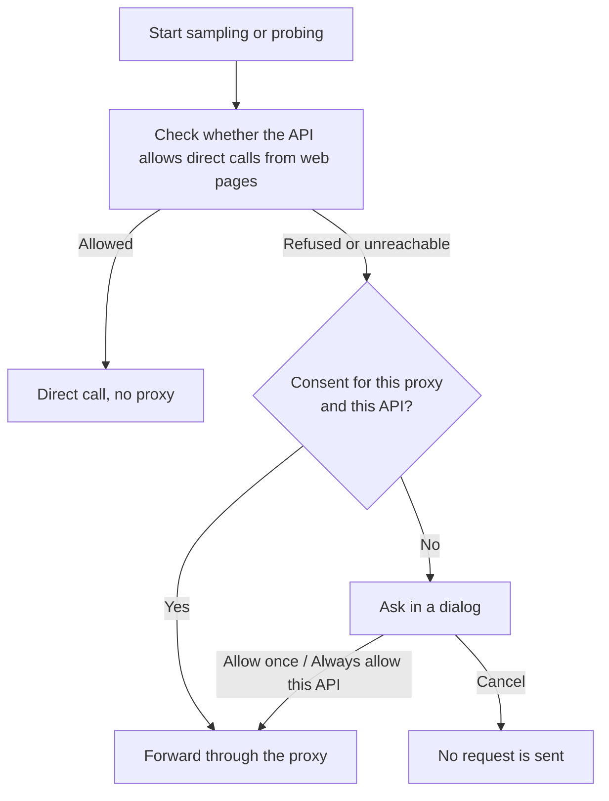

The browser's cross-origin restriction (CORS) decides whether a web page may read the response of an API. Many relays and third-party APIs do not allow web pages to call them directly, so the requests have to go through a server. That server is the forwarding proxy. When the API allows direct calls, the page calls it directly and your API key passes through no third party. When it does not, the page asks you in a dialog first and forwards the requests only after you agree.

What you agree to is that your API key, the challenges, and the model's answers pass through that server on their way to the API. If you do not agree, nothing is sent.

## Connection check

Before each sampling or probing run, the page checks whether the API can be called directly. The check is usually quick. If the API does not respond, it gives its verdict after about 16 seconds at most.

The check does not use up quota. Its request carries a dummy API key (`sk-cors-probe`) and an empty body `{}`, and the API rejects it before it runs any model, so no model runs and no tokens are billed.

The check does not leak your real API key either, because the real key appears only in the requests that follow. Neither the check request nor a direct request carries cookies or a Referer, and neither follows redirects, so a redirect cannot send the API key elsewhere.

If the check reads any HTTP status from the API, even a rejection, web pages can call it directly. If it cannot read one, the page runs a simple connectivity test to tell an API that refuses web pages from a host the browser cannot reach at all. Both cases lead to the consent dialog, which words the reason differently.

The result is kept for 10 minutes, and then the page checks again. If a direct request hits a network error, the next run checks again too. A failed direct request is not switched to the proxy automatically.

## When the dialog appears

The dialog does not appear when the API allows direct calls, or when you have already consented for the same proxy and API. If "Own Worker" is selected and its address is empty or invalid, a request that needs the proxy is never sent, and the page asks you to enter the address first.

## Consent dialog

The dialog names the API host, the reason the requests need forwarding, and the proxy they will pass through. It also reminds you of three things: your API key, the challenges, and the answers pass through that proxy; this site's proxy does not store the key or log request content, while for your own Worker the dialog says this site cannot confirm how it handles the key; and you can revoke consent at any time.

If the reason is that the browser cannot reach the API directly, the problem may lie in the Base URL, a certificate, or the network. Check those first, and choose forwarding only if they are fine.

| Button | Effect |
| --- | --- |
| Cancel | Sends no requests. Pressing Esc, clicking outside the dialog, or clicking the close button does the same |
| Allow once | Valid only in the current page session, and gone after you close or reload the page |
| Always allow this API | Remembered in this browser and applied in other tabs too, until you revoke it |

Consent is recorded separately for each pair of proxy and API host, so switching to another proxy asks again. In the API configuration, the status line below the Base URL shows where the next request will go. When a consent is remembered, a "Revoke proxy consent" link appears next to the status line, and revoking takes effect immediately.

## Forwarding proxy

Which server the requests go through when a proxy is needed is set by "Forwarding proxy" at the bottom of the API configuration. It is a browser-level setting. It applies to all profiles and is not written to exported configuration files.

<Tabs items={['This site', 'Own Worker']}>
  <Tab value="This site">
    The proxy this site provides, at `/api/proxy`, implemented as a Cloudflare Pages server function. It does not store API keys or log request content. If you deploy the website yourself on a static host without server functions, such as GitHub Pages, this proxy does not exist and you need to use your own Worker.
  </Tab>
  <Tab value="Own Worker">
    Enter the address of the Worker you deployed, for example `https://fingerpoint-api-proxy.<subdomain>.workers.dev`. Only HTTPS is accepted. For local testing, `http://localhost` or `http://127.0.0.1` also works. The address is saved as you type, and if you clear it or change it to an invalid address, the saved address is cleared too. A request that needs the proxy is then not sent, the page asks you to enter the address first, and it does not switch to this site's proxy.

    After you choose "Own Worker", a "Deploy your own Worker" area appears below with two entries, "Deploy to Cloudflare" and "Open in the Playground". For how they differ and the steps, see [Own Worker proxy](../deployment/worker.mdx). How your Worker handles the API key depends on the code you deployed. This site cannot confirm it, and the dialog says so.

    Using your own Worker on lm.ikale.io needs no settings change. When the page is not on lm.ikale.io (for example, a site you deployed yourself), add the page's origin to the Worker's `ALLOWED_ORIGINS`, and the "Deploy your own Worker" area shows a hint when this applies. An origin is the protocol, domain, and port of a URL, such as `https://example.com`. For a page hosted on GitHub Pages, the origin is `https://<username>.github.io`, without the repository name. For how to set it, see [Own Worker proxy](../deployment/worker.mdx).
  </Tab>
</Tabs>

"Check proxy" sends one GET health check to the selected proxy without the API key. The result applies only to that proxy:

| Result | Possible cause | What to do |
| --- | --- | --- |
| The proxy works | It returned `{"service":"fingerpoint-api-proxy"}` | Nothing |
| The address is reachable, but this page cannot read its response | The address is not a Fingerpoint proxy, or the Worker's `ALLOWED_ORIGINS` does not include the origin of the current page | Check that the address is the Worker you deployed, then add the current page's origin to `ALLOWED_ORIGINS` |
| The address responded, but not with what a Fingerpoint proxy returns | The address points to another service | Check that you entered the Worker's address |
| Cannot reach this address | A DNS, certificate, or network problem | Check the address and your network |

## What the browser stores

The result of the connection check lives only in the session of the current tab. Your "Always allow this API" consents and the forwarding proxy setting are stored in the browser, and so are the API configuration and the API key. All of this stays in your browser and is never uploaded to this site. Your API key leaves the browser only when a request is sent, to the API or to a forwarding proxy you agree to. Clearing this site's browser data removes all of it, and on the next request the page checks and asks again.
