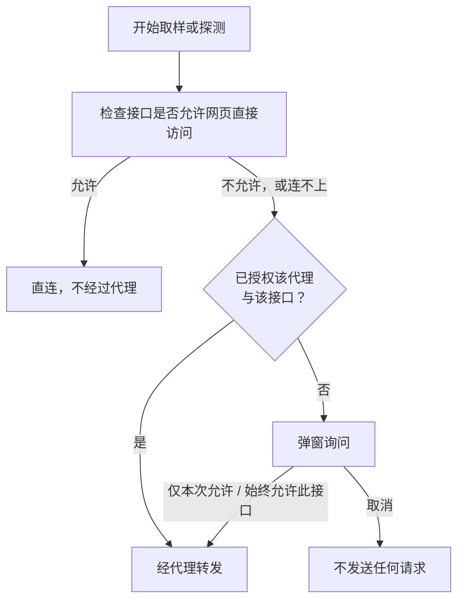

浏览器的跨域限制（CORS）决定网页能否读取某个接口的响应。很多中转站和第三方 API 不允许网页直接访问，这时请求要经一台服务器转发，这台服务器就是转发代理。接口允许时，页面直接请求，API Key 不经过任何第三方。接口不允许时，页面先弹窗询问，你同意后才转发。

你同意的内容是：API Key、挑战和模型回答会经过这台服务器，再送到接口。不同意就不会发送任何请求。

## 连接检查

每次取样或探测开始前，页面先检查接口能否被网页直接访问。检查通常很快，接口没有响应时最长约 16 秒后给出结论。

检查不会消耗额度。它发出的请求带的是假 API Key（`sk-cors-probe`），请求体是空的 `{}`，接口会在运行模型之前拒绝它，所以不运行模型，也不产生 token 费用。

检查也不会泄露你的真 API Key，真 Key 只出现在之后的正式请求里。检查请求和直连请求都不带 Cookie 和来源页面（Referer），也不跟随重定向，API Key 不会随重定向发往别处。

只要读到接口返回的任何 HTTP 状态（哪怕是拒绝），就说明网页可以直连。读不到时，页面再做一次简单的连通测试，区分接口拒绝网页访问和浏览器根本连不上。两种情况都会进入授权，只是对话框里的说明不同。

检查结果保存 10 分钟，之后重新检查。直连请求中途出现网络错误时，下一次也会重新检查。直连失败的请求不会自动改走代理。

## 什么时候会弹窗

接口允许直连时不弹窗，已经授权过同一个代理和接口时也不弹窗。选择了“自建 Worker”但没有填写有效地址时，需要代理的请求不会发送，页面提示你先填写地址。

## 授权对话框

对话框写明接口的主机名、需要转发的原因和将要经过的代理，并提醒三点：API Key、挑战和回答会经过该代理；本站代理不保存密钥，也不记录请求内容，自建 Worker 则提示本站无法确认它如何处理 API Key；授权可以随时撤销。

原因如果是浏览器无法直接连接，问题可能出在接口地址、证书或网络上。先检查这些，确认无误后再选择转发。

| 按钮 | 效果 |
| --- | --- |
| 取消 | 不发送任何请求。按 Esc、点击对话框外的遮罩或点击关闭按钮，效果相同 |
| 仅本次允许 | 只在当前页面会话中有效，关闭或刷新页面后失效 |
| 始终允许此接口 | 记在浏览器本地，其他标签页同步生效，直到你撤销 |

授权按代理和接口域名分别记录，换用另一个代理会重新询问。API 配置里接口地址下方的状态行显示下一次请求的去向。有已记住的授权时，状态行旁边有“撤销代理授权”链接，点击立即生效。

## 转发代理

需要代理时请求经过哪台服务器，由 API 配置底部的“转发代理”决定。它是浏览器级设置，对所有预设生效，不写入导出的配置文件。

<Tabs items={['本站代理', '自建 Worker']}>
  <Tab value="本站代理">
    本站提供的代理，地址是 `/api/proxy`，由 Cloudflare Pages 的服务器函数实现，不保存 API Key，也不记录请求内容。你自己部署的网页如果放在 GitHub Pages 这类没有服务器函数的静态站点上，就没有这个代理，需要改用自建 Worker。
  </Tab>
  <Tab value="自建 Worker">
    填写你部署的 Worker 地址，例如 `https://fingerpoint-api-proxy.<subdomain>.workers.dev`。只接受 HTTPS，本机调试时也可以用 `http://localhost` 或 `http://127.0.0.1`。地址随输入自动保存，清空或改成无效地址时，已保存的地址也会清除。这时需要代理的请求不会发送，页面提示你先填写地址，也不会改走本站代理。

    选择“自建 Worker”后，下方出现“部署自己的 Worker”区，有“部署到 Cloudflare”和“在 Playground 中打开”两个入口，区别和步骤见[自建 Worker 代理](../deployment/worker.mdx)。你的 Worker 怎么处理 API Key，取决于你部署的代码，本站无法确认，对话框也会这样提醒。

    在 lm.ikale.io 上使用自己的 Worker，不需要改任何设置。页面不在 lm.ikale.io 上时（例如你自己部署的站点），要把页面的来源加入 Worker 的 `ALLOWED_ORIGINS`，“部署自己的 Worker”区会在需要时给出提示。来源指网址里协议、域名和端口的部分，例如 `https://example.com`。托管在 GitHub Pages 上的网页，来源是 `https://<用户名>.github.io`，不带仓库名。设置方法见[自建 Worker 代理](../deployment/worker.mdx)。
  </Tab>
</Tabs>

“检查代理”向当前选中的代理发一次 GET 健康检查，不携带 API Key，结果只对应这个代理：

| 结果 | 可能的原因 | 怎么办 |
| --- | --- | --- |
| 代理可用 | 收到了 `{"service":"fingerpoint-api-proxy"}` | 无需处理 |
| 能连上该地址，但页面无法读取响应 | 填写的不是 Fingerpoint 代理，或者 Worker 的 `ALLOWED_ORIGINS` 没有包含当前页面的来源 | 先确认地址是你部署的 Worker，再把当前页面的来源加入 `ALLOWED_ORIGINS` |
| 该地址有响应，但不是代理应有的内容 | 地址指向了别的服务 | 确认填写的是 Worker 的地址 |
| 无法连接 | DNS、证书或网络有问题 | 检查地址和网络 |

## 保存在浏览器里的内容

连接检查的结果只保存在当前标签页的会话里。“始终允许”的授权和转发代理设置保存在浏览器本地，API 配置和 API Key 也保存在浏览器本地。这些内容保存在你的浏览器里，不会上传到本站；API Key 只在发送请求时发给接口，或经你同意的转发代理。清除本站的浏览器数据就会全部删除，下一次请求时页面会重新检查并重新询问。
