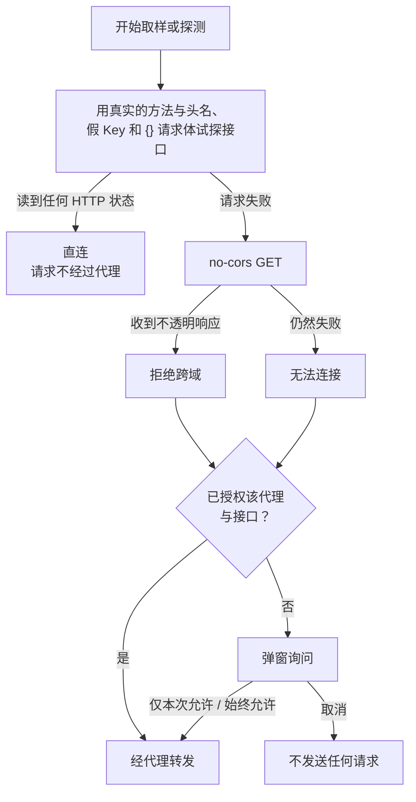

浏览器只能读取允许跨域（CORS）的接口的响应。很多中转站和第三方 API 不允许，这时请求需要一个服务器转发。页面把“是否经过代理”交给你决定：能直连时直连，密钥不经过任何第三方；不能直连时先弹窗说明，经你同意后才转发。

## 连接检查

每次取样或探测开始前，页面按下面的流程决定路由：

试探请求使用真实请求的方法和头名（Messages 协议附带 `anthropic-dangerous-direct-browser-access: true`），但密钥是假的 `sk-cors-probe`，请求体是 `{}`，上游会在运行模型之前拒绝它。直连请求与试探都不携带 Cookie 和 Referer，并且不跟随重定向，避免密钥随重定向发往别处。

结论在本页会话中缓存 10 分钟。直连请求出现网络错误后，下一次会重新检查；失败的直连请求不会被自动改走代理。

## 授权对话框

需要代理时，对话框写明接口主机、原因（拒绝跨域或无法连接）和将要经过的代理，并列出三点：密钥、提示词和回复会经过该代理；代理如何处理密钥；授权可以撤销。

- **取消**：不发送任何请求。按 Esc、点击遮罩或关闭按钮也视为取消。
- **仅本次允许**：只在当前页面会话中有效。
- **始终允许此接口**：写入浏览器的 localStorage，其他标签页同步生效。

授权按“代理 + 接口 origin”记录：换用另一个代理时会重新询问。API 配置中接口地址下方的状态行显示下一次请求的去向，记住的授权旁有“撤销代理授权”链接，撤销立即生效。

## 转发代理

API 配置底部的“转发代理”决定需要代理时经过哪里。它是浏览器级设置，对所有配置预设生效，不写入导出的配置文件。

<Tabs items={['本站代理', '自建 Worker']}>
  <Tab value="本站代理">
    同源的 `/api/proxy`，由 Cloudflare Pages Function 提供。代理不保存密钥，也不记录请求内容。GitHub Pages 等没有服务器函数的静态站点上没有这个代理。
  </Tab>
  <Tab value="自建 Worker">
    填写你部署的 Worker 地址，例如 `https://fingerpoint-api-proxy.<subdomain>.workers.dev`。只接受 HTTPS，本机调试时也可以用 `http://localhost` 或 `http://127.0.0.1`。地址随输入保存；清空或改成无效地址时，已保存的地址也会清除，需要代理的运行不会开始，而是提示你先填写地址，不会回退到本站代理或旧地址。

    对话框会写明“代理”加 Worker 的主机名，并提示本站无法确认你填写的 Worker 如何处理密钥。部署方式见[自建 Worker 代理](../deployment/worker.mdx)。
  </Tab>
</Tabs>

“检查代理”向代理发一次 GET 健康检查，不携带密钥，结果只对应当前选中的代理：

| 结果 | 含义 |
| --- | --- |
| 代理可用 | 返回了 `{"service":"fingerpoint-api-proxy"}` |
| 浏览器无法读取响应 | 能连上该地址，但它不是 Fingerpoint 代理，或 Worker 的 `ALLOWED_ORIGINS` 没有包含当前页面的 origin |
| 没有返回健康检查响应 | 地址可访问，但返回的不是代理的健康检查 |
| 无法连接 | DNS、证书或网络问题 |

## 保存在浏览器中的数据

| 键 | 存储 | 内容 |
| --- | --- | --- |
| `fingerpoint-cors-v1` | sessionStorage | 各接口的连接检查结论，10 分钟后过期 |
| `fingerpoint-proxy-consent-v1` | localStorage | “始终允许”的授权，按代理与接口 origin 记录 |
| `fingerpoint-proxy-v1` | localStorage | 转发代理设置：`{ mode, endpoint }` |

API 配置与密钥另存在 localStorage 中，只在本浏览器可见。
